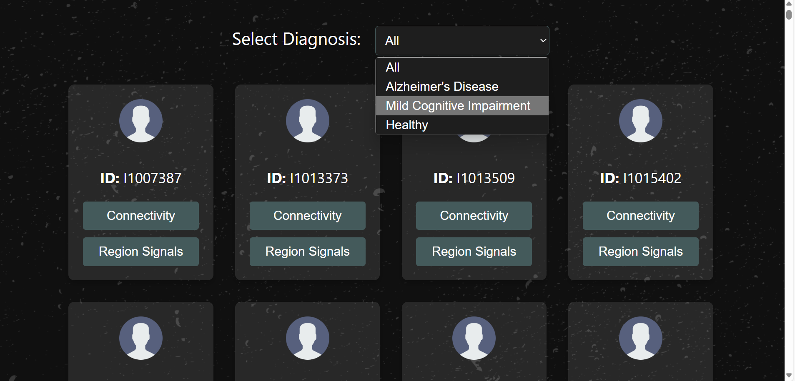
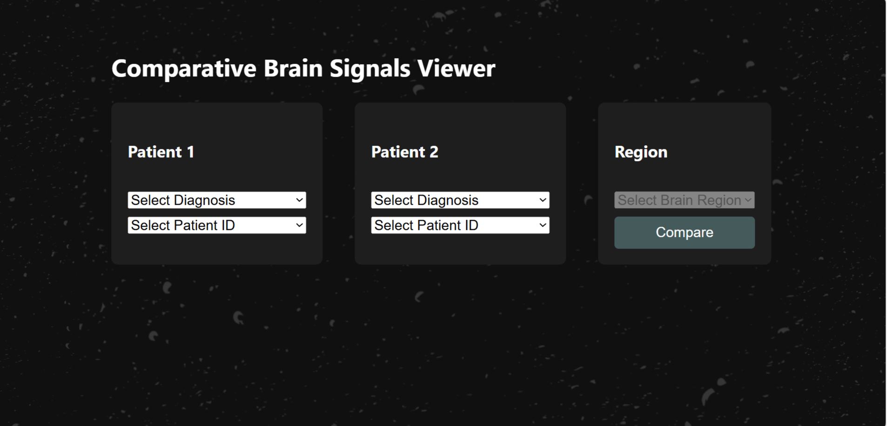

# Brainalytics – Alzheimer's Diagnosis and Brain Connectivity Explorer

  
  
  

  
  
  

  

## Overview

**Brainalytics** is a full-stack web platform developed as part of my Master's thesis to support the diagnosis and exploration of Alzheimer's Disease (AD) using resting-state functional MRI (rs-fMRI).

Alzheimer’s Disease, a progressive neurodegenerative disorder, presents ongoing challenges in early and accurate diagnosis. rs-fMRI has shown promise for revealing alterations in brain connectivity linked to AD, but its widespread clinical adoption is hindered by complex data pipelines and interpretability issues.

This thesis investigates the classification and analysis of AD using rs-fMRI and time series databases. Two experimental approaches were taken:

1. **Experiment 1** used a small multimodal dataset (structural + functional MRI), applying Support Vector Machines to connectivity features derived from anatomical (AAL90) and functional (Schaefer200) brain atlases.
2. **Experiment 2** employed a larger rs-fMRI-only dataset, using Graph Neural Networks on graph representations of brain connectivity.

The SVM approach achieved state-of-the-art performance in AD vs. Cognitively Normal classification (96% accuracy, 97% F1-score). The GNN model also performed well, particularly for AD vs. CN tasks, though distinguishing Mild Cognitive Impairment was more difficult.

To bridge research and real-world application, Brainalytics was developed—offering interactive AI-based diagnosis, patient-specific connectivity heatmaps, and comparative brain region signal analysis.

---

## Key Features

- **Advanced Diagnosis**  
  Upload an rs-fMRI time series to receive an instant AI-based prediction (Alzheimer's vs. Healthy).

- **Patient Database Viewer**  
  Filter by diagnostic group (AD, MCI, CN) and explore individual connectivity matrices and time series.

- **Brain Signals Comparator**  
  Compare activity patterns from any selected brain region across two patients.

---

## Tech Stack

### Frontend

- **React.js**
- **TailwindCSS** for a responsive dark UI
- **Plotly.js** for brain signal and heatmap visualizations

### Backend

- **Flask API** for inference, data retrieval, and file handling
- **GNN/SVM model integration** for classification tasks

### Database

- **InfluxDB** (Time Series Database)  
  Stores brain connectivity matrices and regional time series with patient metadata (ID, age, sex, label)

